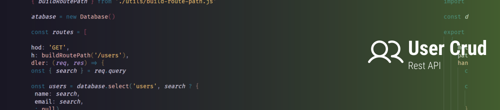
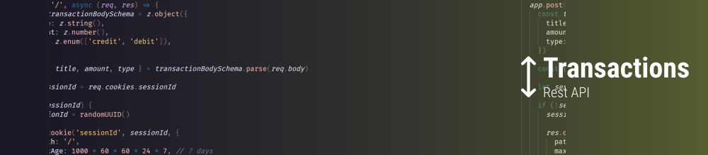
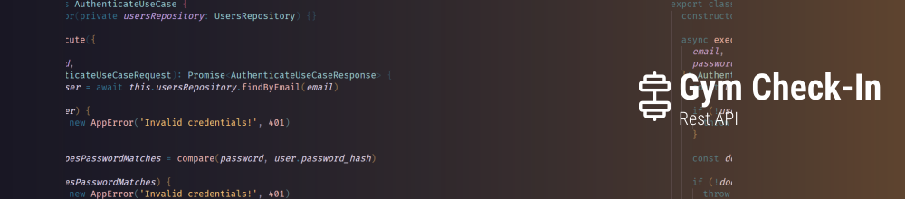
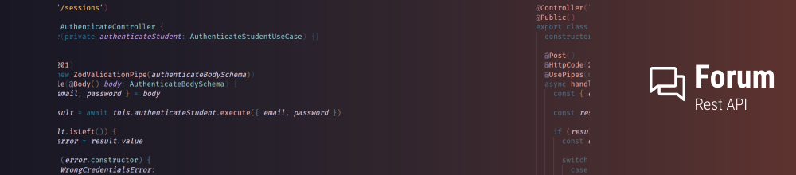
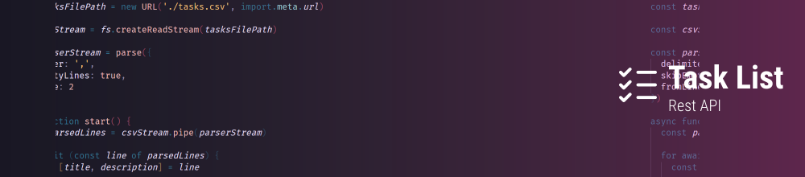
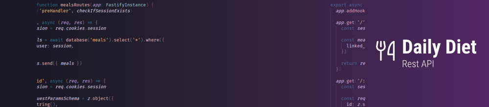
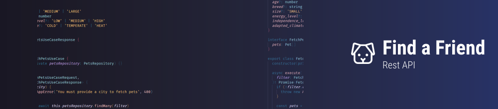

# Ignite - NodeJS Specialization
Node.js is an open-source JavaScript runtime built on Chrome's V8 JavaScript engine, enables server-side development with ease. Its event-driven, non-blocking I/O model facilitates the creation of scalable and high-performance applications. With a vast ecosystem of npm packages, Node.js empowers developers to swiftly build network applications, APIs, and more.

## Projects

### Project 01: User CRUD REST API

User CRUD is a very simple REST API made to handle user creation (CRUD).

<a href="https://github.com/feponiel/ignite-courses-vault/tree/main/ignite-nodejs/projects/project-01">Source Code</a> | <a href="https://github.com/feponiel/ignite-courses-vault/tree/main/ignite-nodejs/projects/project-01/documentation.md">Documentation</a>

---
### Project 02: Transactions REST API

Transactions is a very simple REST API made to help you to control your balance.

<a href="https://github.com/feponiel/ignite-courses-vault/tree/main/ignite-nodejs/projects/project-02">Source Code</a> | <a href="https://github.com/feponiel/ignite-courses-vault/tree/main/ignite-nodejs/projects/project-02/documentation.md">Documentation</a>

---

### Project 03: Gym Check-In REST API

Gym Check-In is a REST API made to help gyms control user entry through a check-in system.

<a href="https://github.com/feponiel/ignite-courses-vault/tree/main/ignite-nodejs/projects/project-03">Source Code</a> | <a href="https://github.com/feponiel/ignite-courses-vault/tree/main/ignite-nodejs/projects/project-03/documentation.md">Documentation</a>

---

### Project 04: Forum REST API

Forum is a complete forum REST API with Q&A and attachments system made using the Domain-Driven Design approach.

<a href="https://github.com/feponiel/ignite-courses-vault/tree/main/ignite-nodejs/projects/project-04">Source Code</a> | <a href="https://github.com/feponiel/ignite-courses-vault/tree/main/ignite-nodejs/projects/project-04/documentation.md">Documentation</a>

 

## Challenges

### Challenge 01: Task List REST API

Task List is a very simple REST API made to organize your daily tasks.

<a href="https://github.com/feponiel/ignite-courses-vault/tree/main/ignite-nodejs/challenges/challenge-01">Source Code</a> | <a href="https://github.com/feponiel/ignite-courses-vault/tree/main/ignite-nodejs/challenges/challenge-01/documentation.md">Documentation</a>

---

### Challenge 02: Daily Diet REST API

Daily Diet is a very simple REST API made to help you to control your diet.

<a href="https://github.com/feponiel/ignite-courses-vault/tree/main/ignite-nodejs/challenges/challenge-02">Source Code</a> | <a href="https://github.com/feponiel/ignite-courses-vault/tree/main/ignite-nodejs/challenges/challenge-02/documentation.md">Documentation</a>

---

### Challenge 03: Find a Friend REST API

Find a Friend is a REST API made to help you to find your new four-legged friend.

<a href="https://github.com/feponiel/ignite-courses-vault/tree/main/ignite-nodejs/challenges/challenge-03">Source Code</a> | <a href="https://github.com/feponiel/ignite-courses-vault/tree/main/ignite-nodejs/challenges/challenge-03/documentation.md">Documentation</a>
