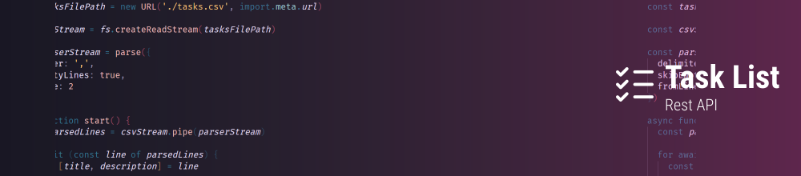

# Ignite NodeJS Challenge 01: Task List REST API
Task List is a very simple REST API made to organize your daily tasks.

<br />

## Get started
To enjoy this application you will need to run the project on your computer. Start downloading the project and installing the dependencies:

> Is required to have [NodeJS](https://nodejs.org/en) installed on your machine.

```
npm install
```

After that, you'll be able to run the project on your machine without any problems just running the command below:

```
npm run dev
```

> OBS: Upload tasks in bulk through a .csv file named `tasks.csv` in [data-import](https://github.com/feponiel/ignite-courses-vault/tree/main/ignite-nodejs/challenges/challenge-01/data-import) by running the command below:

```
npm run bulk-tasks
```

<br />

## Technologies & Tools
NodeJS, JavaScript.

<br />

## More about
<a href="https://github.com/feponiel/ignite-courses-vault/tree/main/ignite-nodejs/challenges/challenge-01/documentation.md">API Documentation</a> | <a href="https://opensource.org/license/mit">License</a>
