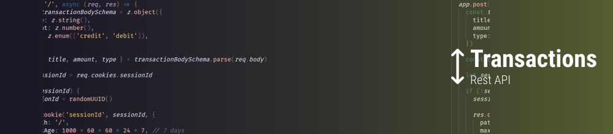

# Ignite NodeJS Project 02: Transactions REST API
Transactions is a very simple REST API made to help you to control your balance.

<br />

## Get started
To enjoy this application you will need to run the project on your computer. Start downloading the project and installing the dependencies:

> Is required to have [NodeJS](https://nodejs.org/en) installed on your machine.

```
npm install
```

Then, you'll need to setup your `.env` and `.env.test`.

> You can see an example of how to setup your environment variables in [.env.example](https://github.com/feponiel/ignite-courses-vault/tree/main/ignite-nodejs/projects/project-02/.env.example) and [.env.test.example](https://github.com/feponiel/ignite-courses-vault/tree/main/ignite-nodejs/projects/project-02/.env.test.example)

```
# Your .env file will look like this

NODE_ENV="development"
DATABASE_CLIENT="sqlite"
DATABASE_URL="./database/app.db"
```
```
# Your .env.test file will look like this

DATABASE_CLIENT="sqlite"
DATABASE_URL="./database/test.db"
```

<br />

After these steps, you will need to run the migrations

```
npm run knex -- migrate:latest
```

Now, you can finally run the application:

```
npm run dev
```

<br />

## Technologies & Tools
NodeJS, Fastify, TypeScript, Knex, Zod, Vitest, Cookies.

<br />

## More about
<a href="https://github.com/feponiel/ignite-courses-vault/tree/main/ignite-nodejs/projects/project-02/documentation.md">API Documentation</a> | <a href="https://opensource.org/license/mit">License</a>
