# Ignite - ReactJS Specialization
ReactJS is an open-source JavaScript library, maintained by Facebook, that is used to build interactive and dynamic user interfaces (UI). With an approach based on reusable components, React enables efficient development of modern web applications. Its simple and effective architecture makes it easy to create responsive and high-performance interfaces.

## Projects

### Project 01: Ignite Feed

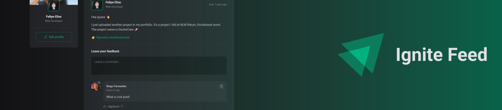

Ignite Feed is a little blog application where you can share your ideas with people

<a href="https://github.com/feponiel/ignite-courses-vault/tree/main/ignite-reactjs/projects/project-01">Source Code</a> | <a href="https://www.figma.com/file/JuCGXtGkQEVduYM7KlkkB7/Ignite-Feed-(Community)">Figma Layout</a>

---
### Project 02: Ignite Timer

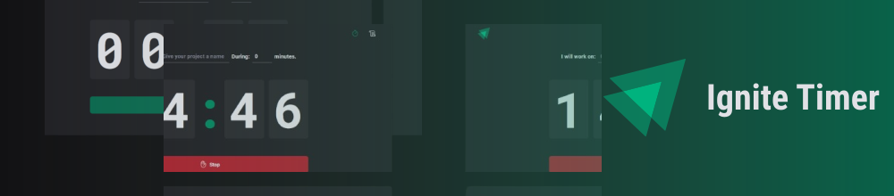

Ignite Timer is a timer application where you can time your tasks and have a history.

<a href="https://github.com/feponiel/ignite-courses-vault/tree/main/ignite-reactjs/projects/project-02">Source Code</a> | <a href="https://www.figma.com/file/POPSNs7QkYI3Hr8qyoA4kU/Ignite-Timer-(Community)">Figma Layout</a>

---

### Project 03: DT Money

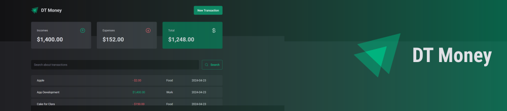

DT Money is a little finance application where you can control your income and expenses.

<a href="https://github.com/feponiel/ignite-courses-vault/tree/main/ignite-reactjs/projects/project-03">Source Code</a> | <a href="https://www.figma.com/file/tbN3IRcIeyNlLjF0hkcGqW/DT-Money-(Community)">Figma Layout</a>

---

### Project 04: Ignite Shop

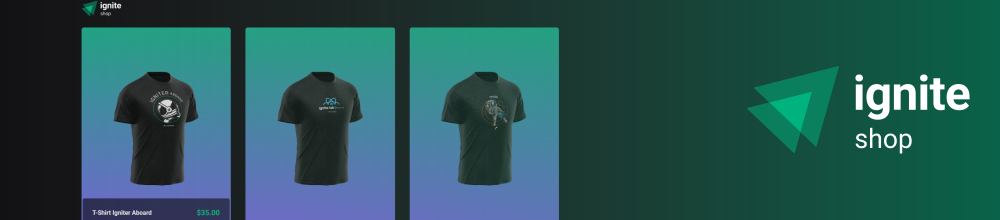

Ignite Shop is a little and simple e-commerce integrated with Stripe, where you can showcase and sell your products.

<a href="https://github.com/feponiel/ignite-courses-vault/tree/main/ignite-reactjs/projects/project-04">Source Code</a> | <a href="https://www.figma.com/file/HotKgAtvZ0xhGlvOQFhDCh/Ignite-Shop-•-Projeto-React-(Copy)">Figma Layout</a>

---

### Project 05: Ignite UI (Design System)

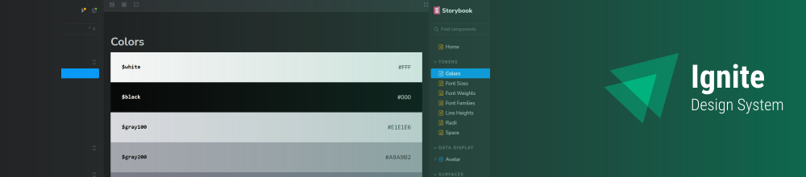

Ignite UI is a simple Design System made using ReactJS and Storybook

<a href="https://github.com/feponiel/ignite-courses-vault/tree/main/ignite-reactjs/projects/project-05">Source Code</a>

---

### Project 06: Ignite Call

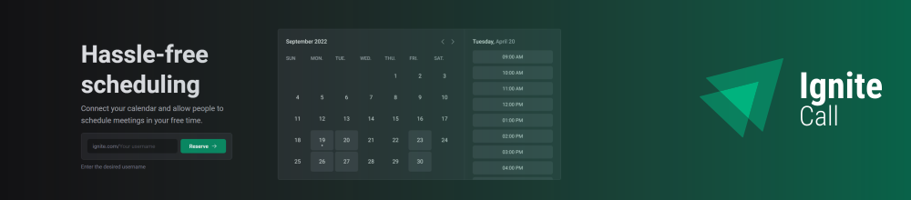

Ignite Call is a scheduling application integrated with Google Calendar, where you can make easy the process of scheduling meetings.

<a href="https://github.com/feponiel/ignite-courses-vault/tree/main/ignite-reactjs/projects/project-06">Source Code</a> | <a href="https://www.figma.com/file/AguHzZrqcMUVta7MEJTQP9/Ignite-Call-(Community)">Figma Layout</a>

 

## Challenges

### Challenge 01: TODO List

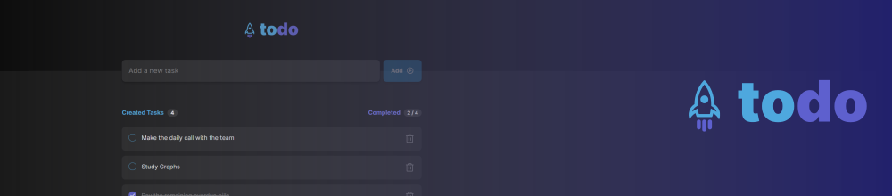

TODO List is a mini to-do application where you can easily organize your daily tasks.

<a href="https://github.com/feponiel/ignite-courses-vault/tree/main/ignite-reactjs/challenges/challenge-01">Source Code</a> | <a href="https://www.figma.com/file/vuy7o5brpOdHxkMUqAzuFT/ToDo-List-•-Desafio-React-(Copy)">Figma Layout</a>

---

### Challenge 02: Coffee Delivery

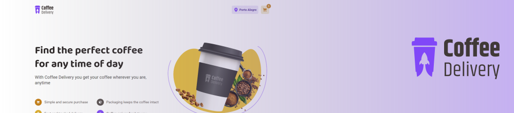

Coffee delivery is a little ecommerce where you can order the perfect coffee any time of day. 

<a href="https://github.com/feponiel/ignite-courses-vault/tree/main/ignite-reactjs/challenges/challenge-02">Source Code</a> | <a href="https://www.figma.com/file/mqiKsbxPSXhdNnHlgDR2Vn/Coffee-Delivery-•-Desafio-React-(Copy)">Figma Layout</a>

---

### Challenge 03: Github Blog

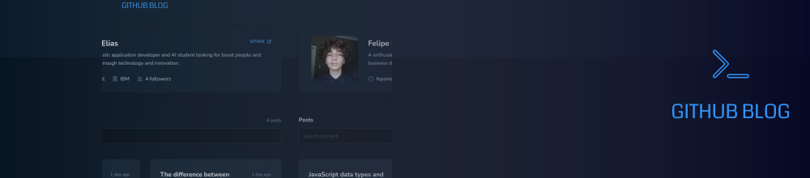

Github blog is a little blog application that turns your repository issues into posts.

<a href="https://github.com/feponiel/ignite-courses-vault/tree/main/ignite-reactjs/challenges/challenge-03">Source Code</a> | <a href="https://www.figma.com/file/w5KE9OJLyYBWzXAun3ZOIz/GitHub-Blog-(Community)">Figma Layout</a>

---

### Challenge 04: Ignite Shop 2.0

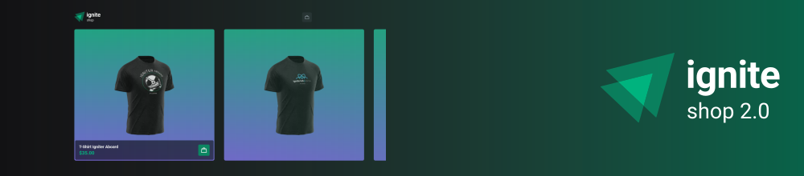

Ignite Shop (v2) is a little and simple e-commerce integrated with Stripe, where you can showcase and sell your products.

<a href="https://github.com/feponiel/ignite-courses-vault/tree/main/ignite-reactjs/challenges/challenge-04">Source Code</a> | <a href="https://www.figma.com/file/qSNBWUDA7ZPFSJIP60FjRw/Ignite-Shop-2.0-•-Desafio-React-(Copy)">Figma Layout</a>

---

### Challenge 05: Ignite UI (Addon)

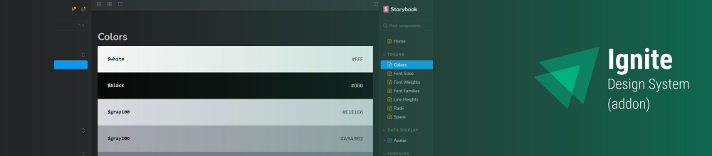

This challenge was an addition in the [Project 05 (Ignite UI)](https://github.com/feponiel/ignite-courses-vault/tree/main/ignite-reactjs/projects/project-05), where was made 2 new components including: Tooltip and Toast.

<a href="https://github.com/feponiel/ignite-courses-vault/tree/main/ignite-reactjs/challenges/challenge-05">More about</a>

---

### Challenge 06: Bookwise

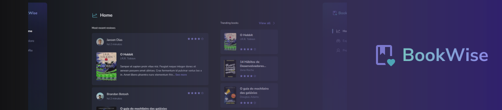

Bookwise is a book review application where you can share your reviews and comments about readings with people.

<a href="https://github.com/feponiel/ignite-courses-vault/tree/main/ignite-reactjs/challenges/challenge-06">Source Code</a> | <a href="https://www.figma.com/file/1dWWhwGpT87zmn90sN0clS/BookWise--•-Desafio-React-(Copy)">Figma Layout</a>
