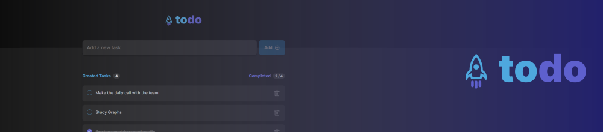

# Ignite ReactJS Challenge 01: TODO List
TODO List is a mini to-do application where you can easily organize your daily tasks.

<br />

## Get started
To enjoy this little application you will need to run the project on your computer. Start downloading the project and installing the dependencies:

> Is required to have [NodeJS](https://nodejs.org/en) installed on your machine.

```
npm install
```

After that, you'll be able to run the project on your machine without any problems just running the command below:

```
npm run dev
```

<br />

## Technologies & Tools
Vite, ReactJS, CSS Modules, TypeScript, Local Storage.

<br />


## More about
<a href="https://www.figma.com/file/vuy7o5brpOdHxkMUqAzuFT/ToDo-List-•-Desafio-React-(Copy)">Figma Layout</a> | <a href="https://opensource.org/license/mit">License</a>
