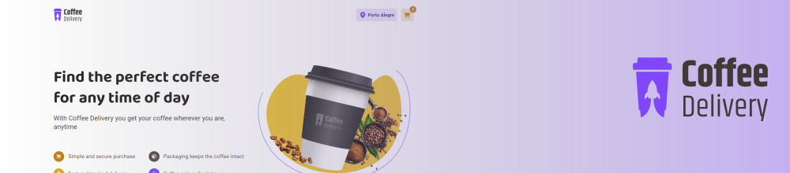

# Ignite ReactJS Challenge 02: Coffee Delivery
Coffee delivery is a little ecommerce where you can order the perfect coffee any time of day. 

<br />

## Get started
To enjoy this little application you will need to run the project on your computer. Start downloading the project and installing the dependencies:

> Is required to have [NodeJS](https://nodejs.org/en) installed on your machine.

```
npm install
```

Then, you'll need to run the application server (which is a JSON server on `server.json`):

```
npm run dev:server
```

After that, you'll be able to run the project on your machine without any problems just running the command below in another terminal:

```
npm run dev
```

<br />

## Technologies & Tools
Vite, ReactJS, Styled-Components, TypeScript, React Router DOM, React Hook Form, React Context API, Zod, Axios, JSON Server.

<br />

## More about
<a href="https://www.figma.com/file/mqiKsbxPSXhdNnHlgDR2Vn/Coffee-Delivery-•-Desafio-React-(Copy)">Figma Layout</a> | <a href="https://opensource.org/license/mit">License</a>