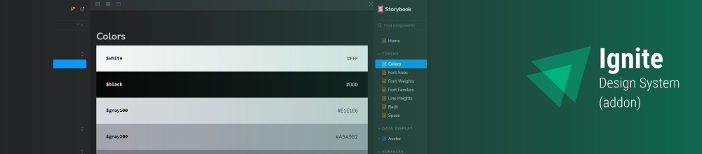

# Ignite ReactJS Challenge 05: Ignite UI (Addon)
This challenge was an addition in the [Project 05 (Ignite UI)](https://github.com/feponiel/ignite-courses-vault/tree/main/ignite-reactjs/projects/project-05), where was made 2 new components including: Tooltip and Toast.

> Because it was just a few changes in the project, the challenge source isn't available in this folder, but you can check it in the Project 05 Folder itself by clicking on the links below:

- [Tooltip component](https://github.com/feponiel/ignite-courses-vault/tree/main/ignite-reactjs/projects/project-05/packages/react/src/components/Tooltip)

- [Toast component](https://github.com/feponiel/ignite-courses-vault/tree/main/ignite-reactjs/projects/project-05/packages/react/src/components/Toast)