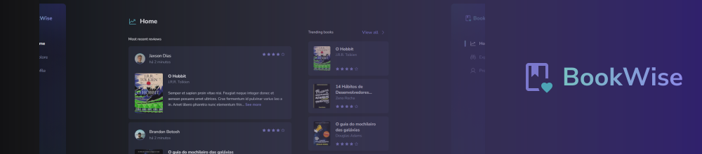

# Ignite ReactJS Challenge 06: Bookwise
Bookwise is a book review application where you can share your reviews and comments about readings with people.

<br />

## Get started
To enjoy this application you will need to run the project on your computer. Start downloading the project and installing the dependencies:

> Is required to have [NodeJS](https://nodejs.org/en) installed on your machine.

```
npm install
```

Then, you'll need to set your [Google oAuth API Credentials](https://docs.stripe.com/keys) and [Github oAuth API Credentials](https://github.com/settings/applications/new) inside a .env file.

> You can read more about in: [Using OAuth 2.0 to Access Google APIs](https://developers.google.com/identity/protocols/oauth2) and [Authorizing OAuth apps - GitHub Docs](https://docs.github.com/en/apps/oauth-apps/building-oauth-apps/authorizing-oauth-apps)
 
<br />

### It's good to remember:
When creating your Google oAuth Client ID Credential, it's very important to set `http://localhost:3000/api/auth/callback/google` as an Authorized Redirect URI

> You shouldn't forget to [active the Google Calendar API](https://console.cloud.google.com/apis/library/calendar-json.googleapis.com) in your project

> You can see an example of how to setup your environment variables in [.env.example](https://github.com/feponiel/ignite-courses-vault/tree/main/ignite-reactjs/challenges/challenge-06/.env.example)

```
# Your .env file will look like this

DATABASE_URL="file:./dev.db"

GOOGLE_CLIENT_ID="YOUR_GOOGLE_OAUTH_CLIENT_ID"
GOOGLE_CLIENT_SECRET="YOUR_GOOGLE_OAUTH_CLIENT_SECRET"

GITHUB_CLIENT_ID="YOUR_GITHUB_OAUTH_CLIENT_ID"
GITHUB_CLIENT_SECRET="YOUR_GITHUB_OAUTH_CLIENT_SECRET"

# The Next auth secret can be any text

NEXTAUTH_URL="http://localhost:3000"
NEXTAUTH_SECRET="RANDOM_TEXT"
```

<br />

After these steps, you will need to run the migrations

```
npx prisma migrate dev
```

Now, you can finally run the application:

```
npm run dev
```

<br />

## Technologies & Tools
ReactJS, NextJS, Stitches, TypeScript, Prisma, React Query, Next API Routes, oAuth, Google Calendar API, Axios.

<br />

## More about
<a href="https://www.figma.com/file/1dWWhwGpT87zmn90sN0clS/BookWise--•-Desafio-React-(Copy)">Figma Layout</a> | <a href="https://opensource.org/license/mit">License</a>
