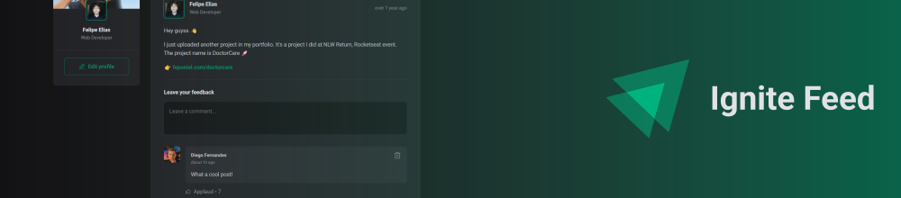

# Ignite ReactJS Project 01: Ignite Feed
Ignite Feed is a little blog application where you can share your ideas with people.

## Get started
To enjoy this little application you will need to run the project on your computer. Start downloading the project and installing the dependencies:

> Is required to have [NodeJS](https://nodejs.org/en) installed on your machine.

```
npm install
```

After that, you'll be able to run the project on your machine without any problems just running the command below:

```
npm run dev
```

## Technologies & Tools
Vite, ReactJS, CSS Modules, TypeScript, Local Storage.

## More about
<a href="https://www.figma.com/file/JuCGXtGkQEVduYM7KlkkB7/Ignite-Feed-(Community)">Figma Layout</a> | <a href="https://github.com/feponiel/ignite-courses-vault/blob/main/ignite-reactjs/projects/project-01/LICENSE">License</a>