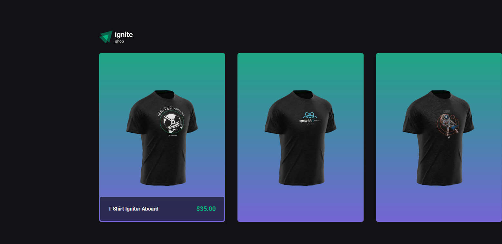

<h1 align="center">IGNITE SHOP 🛒</h1>
<h3 align="center">ROCKETSEAT IGNITE REACTJS: PROJECT 4 FILES</h3>

 

    

 

#### TECHNOLOGIES:
- NextJS ⚜
- Stitches 🎨
- TypeScript 💻
- ReactJS ⚛
- NodeJS 🐱‍👤

 

#### HOW TO USE:
* First have NodeJS on your machine
* With the project folder already open in VS CODE (or similar) make sure you have set the environment variables: "NEXT_URL" (main site url), "STRIPE_PUBLIC_KEY" and "STRIPE_SECRET_KEY"
* Type the commands in the sequence: "npm install" and "npm run dev"
* Then open the domain that appeared in your console
* Finally, use and enjoy the Ignite Shop!

 

Felipe Macci

