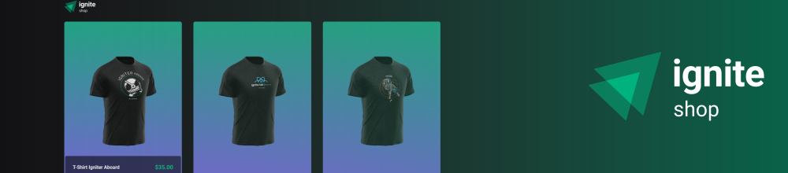

# Ignite ReactJS Project 04: Ignite Shop
Ignite Shop is a little and simple e-commerce integrated with Stripe, where you can showcase and sell your products.

<br />

## Get started
To enjoy this little application you will need to run the project on your computer. Start downloading the project and installing the dependencies:

> Is required to have [NodeJS](https://nodejs.org/en) installed on your machine.

```
npm install
```

<br />

Then, you'll need to set your [Stripe API Keys](https://docs.stripe.com/keys) inside a .env file.

> You can see an example of how to setup your environment variables in [.env.example](https://github.com/feponiel/ignite-courses-vault/tree/main/ignite-reactjs/projects/project-04/.env.example)

```
# Your .env file will look like this

NEXT_URL="http://localhost:3000"

STRIPE_PUBLIC_KEY="YOUR_PUBLIC_KEY_HERE"
STRIPE_SECRET_KEY="YOUR_SECRET_KEY_HERE"
```

<br />

After these steps, you will need to [create some products](https://support.stripe.com/questions/how-to-create-products-and-prices) in your store.

Finally, you'll be able to run the project on your machine without any problems just running the command below:

```
npm run dev
```

<br />

## Technologies & Tools
ReactJS, NextJS, Stitches, TypeScript, Next API Routes, Axios, Stripe.

<br />

## More about
<a href="https://www.figma.com/file/HotKgAtvZ0xhGlvOQFhDCh/Ignite-Shop-•-Projeto-React-(Copy)">Figma Layout</a> | <a href="https://opensource.org/license/mit">License</a>