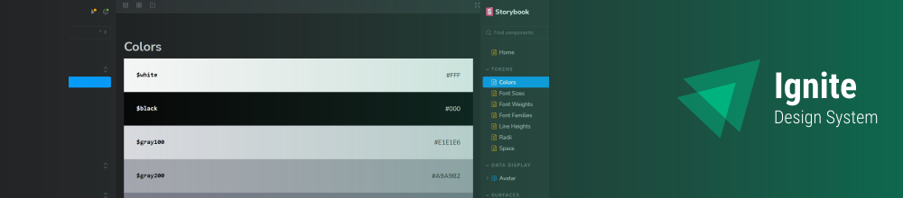

# Ignite ReactJS Project 05: Ignite UI (Design System)
Ignite UI is a simple Design System made using ReactJS and Storybook

## Get started
To see the design system page you will need to run the project on your computer. Start downloading the project and installing the dependencies:

> Is required to have [NodeJS](https://nodejs.org/en) installed on your machine.

```
npm install
```

After that, you'll be able to run the project on your machine without any problems just running the command below:

```
npm run dev
```

## Technologies & Tools
ReactJS, Stitches, TypeScript, Radix UI, Storybook.

## More about
<a href="https://opensource.org/license/mit">License</a>